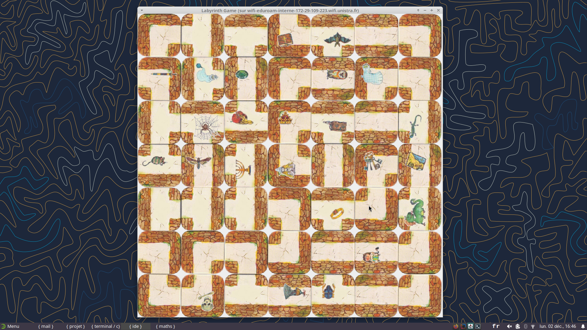

A31 - Projet "Labyrinthe"
=========================

Les règles du jeu
-----------------

Elles sont disponibles :

- en version textuelle : [https://www.regledujeu.fr/labyrinthe/](https://www.regledujeu.fr/labyrinthe/).
- en vidéo avec Ludochrono : [https://www.youtube.com/watch?v=pGzenrQnJ9g](https://www.youtube.com/watch?v=pGzenrQnJ9g).

Côté matériel, le jeu de société comporte **50 tuiles** de 3 sortes :

- 20 angles dont 4 sont fixes et 16 sont déplaçables,
- 12 sections droites toutes déplaçables,
- 18 en forme de "T" dont 12 sont fixes et 6 sont déplaçables.

Il y a également **24 objectifs**.

Nous nous limiterons à un nombre fixe de **4 joueurs**.

Captures d'écran
-----------------

Les fonctionnalités
-------------------

1 - La **génératon des tuiles**

- Niveau 1 : avec une orientation initiale fixe
- Niveau 2 : avec une orientation initiale aléatoire

2 - Le **génération du plateau** avec les tuiles :

- Niveau 1 : placées de façon fixe (toujours le même plateau de départ)
- Niveau 2 : placées toutes de façon aléatoire
- Niveau 3 : placées de façon fixe ou aléatoire comme dans le jeu de société

3 - L'**ajout des objectifs** sur les tuiles :

- Niveau 1 : placés de façon fixe
- Niveau 2 : placés de façon totalement aléatoire, 1 seul maximum par tuile
- Niveau 3 : placés de façon aléatoire mais pas sur les cases du départ des joueurs

4 - La **distribution des "cartes objectifs"** aux joueurs :

- Niveau 1 : de façon fixe
- Niveau 2 : de façon aléatoire

5 - Le **déplacement des pions case par case**

6 - Le **déplacement d'une ligne ou colonne du plateau** par la tuile supplémentaire :

- Niveau 1 : Toutes les lignes et colonnes
- Niveau 2 : Uniquement les lignes et colonnes impaires
- Niveau 3 : En gérant le passage d'un joueur éjecté au côté opposé de la ligne/colonne actuelle
- Niveau 4 : En interdisant le déplacement inverse du précédent

7 - La **détection d'un objectif atteint** par un joueur et le passage à l'objectif suivant

8 - La **détection de la fin du tour d'un joueur**

9 - La **détection de la fin de partie** lorsqu'un joueur a trouvé tous ses objectifs et est revenu à sa position de départ

L'interface graphique
---------------------

Le jeu comporte 2 écrans :

- un **écran principal** qui permet de jouer une partie
- un **écran de fin de partie**

### Écran principal

L'écran principal doit afficher :

- le plateau de 7 par 7 avec les 49 tuiles, les 24 objectifs et les pions de chaque joueur
- La tuile supplémentaire actuelle
- Pour chaque joueur :
  - son objectif actuel
  - le nombre d'objectifs déjà récupérés
  - le nombre d'objectifs restants

À son tour, **un joueur doit pouvoir réaliser les actions suivantes** :

- Pousser une ligne ou colonne avec la tuile supplémentaire
- Se déplacer de case en case sur les tuiles voisines où le déplacement est possible.

Vous avez à votre disposition le fichier [`ImageHelper.java`](src/main/views/helpers/ImageHelper.java) pour manipuler les images, notamment :

- combiner plusieurs images en une seule
- appliquer une rotation de 90 degrés à une image

***Bonus 1***

À son tour, le joueur peut faire **tourner la tuile supplémentaire** par pas de 90 degrés dans le sens horaire ou anti-horaire avant de l'utiliser pour pousser une ligne ou colonne.

### Écran de fin de partie

L'écran de fin de partie doit annoncer le vainqueur.

***Bonus 2***

L'écran de fin de partie propose de commencer une nouvelle partie : tout doit petre réinitialisé pour recommencer.